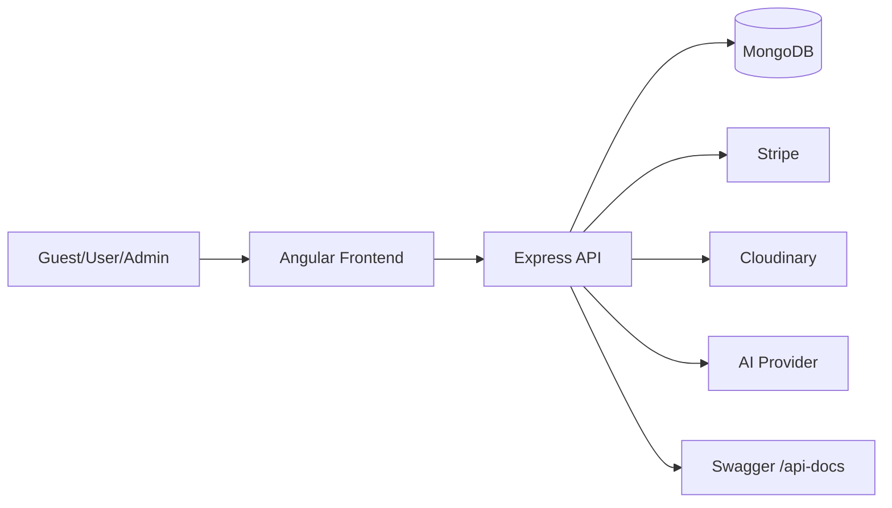
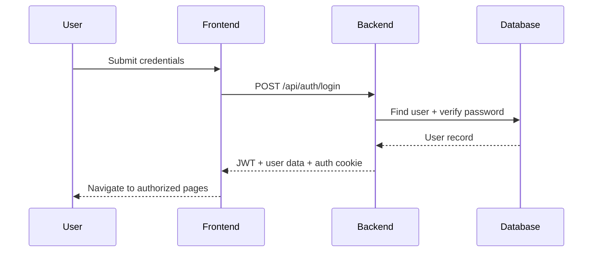

# Eventify System Operations & User Flows

Comprehensive technical operations handbook for the Eventify platform (Angular client + Node/Express API + MongoDB + Stripe + Cloudinary + AI assistant services).

## Table of Contents

1. [System Overview](#system-overview)
2. [Architecture & Component Interaction](#architecture--component-interaction)
3. [Authentication & Authorization Lifecycle](#authentication--authorization-lifecycle)
4. [Global Request Lifecycle](#global-request-lifecycle)
5. [State Management Model (Frontend)](#state-management-model-frontend)
6. [Operation Flows](#operation-flows)
   - [User Registration](#operation-user-registration)
   - [User Login](#operation-user-login)
   - [User Logout](#operation-user-logout)
   - [Profile Update and Avatar Upload](#operation-profile-update-and-avatar-upload)
   - [Event Discovery and Event Details](#operation-event-discovery-and-event-details)
   - [Favorites Management](#operation-favorites-management)
   - [Event Reviews and Voting](#operation-event-reviews-and-voting)
   - [Booking Creation](#operation-booking-creation)
   - [Checkout Payment Processing](#operation-checkout-payment-processing)
   - [Booking Management (User and Admin)](#operation-booking-management-user-and-admin)
   - [Admin Dashboard Analytics](#operation-admin-dashboard-analytics)
   - [Admin User/Message/Subscriber Management](#operation-admin-usermessagesubscriber-management)
   - [Contact and Newsletter Public Flows](#operation-contact-and-newsletter-public-flows)
   - [AI Assistant Chat Flow](#operation-ai-assistant-chat-flow)
7. [Cross-Cutting Error Handling](#cross-cutting-error-handling)
8. [Security Controls Summary](#security-controls-summary)
9. [Known Gaps and Edge Behaviors](#known-gaps-and-edge-behaviors)

---

## System Overview

Eventify supports:

- Public event browsing and filtering
- Authenticated booking, favorites, profile management, and AI chat
- Admin operations (dashboard analytics, user moderation, booking operations, contact/newsletter moderation)
- Payment processing via Stripe (`payment-intent`, `sync-payment`, webhook confirmation)
- Media handling via Cloudinary (event images and profile avatars)

Primary actors:

- Guest user
- Authenticated user
- Admin
- Angular frontend
- Backend API
- MongoDB collections (`users`, `events`, `bookings`, reviews, votes, support modules)
- Stripe
- Cloudinary
- AI model provider through backend service abstraction

---

## Architecture & Component Interaction



Operational boundaries:

- Frontend: route guards, forms, user interactions, local/session state, optimistic UI in specific paths
- Backend: validation, authorization, business rules, persistence, integrations
- Database: source of truth for users/events/bookings/reviews/support data
- Third-party systems: payment state, media storage, AI responses

---

## Authentication & Authorization Lifecycle

### Mechanism

- Login/Register response includes JWT token and user payload.
- Backend also sets auth cookie (`res.cookie(...)`).
- `protect` middleware accepts either:
  - `Authorization: Bearer <token>`
  - token from auth cookie

### Authorization

- Role checks via `authorize([...roles])`.
- Admin routes are grouped behind `router.use(protect, authorize(["admin"]))`.

### Guarding in Frontend

- `authGuard` for user-only routes
- `adminGuard` for admin routes
- Route configuration enforces protected page access at navigation time



---

## Global Request Lifecycle

1. Request enters `app.js`.
2. Middleware chain:
   - security headers (`helmet`)
   - CORS
   - cookie parsing
   - logging
   - API limiter
3. Route matching and route-level middleware:
   - body validation
   - auth (`protect`)
   - role check (`authorize`)
4. Controller business logic:
   - DB reads/writes
   - optional external integrations
5. Structured JSON response.
6. If any error occurs:
   - routed to centralized `errorHandler`
   - normalized response shape with status code and message

Special case:

- Stripe webhook endpoint is mounted before JSON parser and uses raw body for signature verification.

---

## State Management Model (Frontend)

Primary state patterns used:

- Angular signals for local view state
- Service-level cached observables (`shareReplay`) for hot data
- `BehaviorSubject` for reactive counters (favorites count)
- Route query params as state source for admin list filters
- Local storage for auth token/user payload in `AuthService`

Key synchronization points:

- Booking/favorite mutations invalidate service caches
- Header/profile reactive counters subscribe to service streams
- Admin list pages sync route query params to form state and API requests

---

## Operation Flows

## Operation: User Registration

### Purpose

Create a new user account with optional avatar upload and immediate authenticated session.

### Actors Involved

- Guest user
- Frontend registration page
- Backend auth controller
- MongoDB `users`
- Cloudinary (optional image upload)

### Preconditions

- User provides `name`, `email`, `password`
- Email not already registered

### Step-by-Step Flow

1. User submits register form (plain fields or multipart with `image`).
2. Frontend sends `POST /api/auth/register`.
3. Backend validates required fields.
4. Backend checks duplicate email.
5. If image file exists:
   - upload image buffer to Cloudinary
   - store `pictureUrl` and `picturePublicId`
6. If no image:
   - generate fallback avatar URL from name.
7. Backend creates `User` document and hashes password through model hooks.
8. JWT generated and auth cookie set.
9. Response returns user data + token.
10. Frontend stores auth data and updates application auth state.

### Example Request/Response

```http
POST /api/auth/register
Content-Type: application/json
```

```json
{
  "name": "Ahmed Maher",
  "email": "ahmed@example.com",
  "password": "Strong123!"
}
```

```json
{
  "success": true,
  "message": "User registered successfully",
  "token": "<jwt>",
  "data": { "id": "...", "role": "user", "email": "ahmed@example.com" }
}
```

### Validation Rules

- required: name/email/password
- unique email
- backend-level business checks and model-level constraints

### Error Handling

- duplicate email -> 409
- missing required fields -> 400
- upload/provider failures -> internal error path

### Security Considerations

- password hashing
- JWT issuance
- cookie + token support
- no plain password in responses

### Database Impact

- `users`: new document insert

### State Management Flow

- `AuthService.register()` persists token and user to localStorage

### Notes & Edge Cases

- Avatar upload is optional.
- If upload fails, request fails and user is not partially created.

---

## Operation: User Login

### Purpose

Authenticate existing user and establish session state.

### Actors Involved

- User, frontend login page, backend auth controller, `users` collection

### Preconditions

- Valid email/password combination
- User account is active

### Step-by-Step Flow

1. User submits login credentials.
2. Frontend calls `POST /api/auth/login`.
3. Backend finds user by email.
4. Backend rejects inactive accounts.
5. Password comparison via model method.
6. JWT generated and cookie set.
7. Response returns success + token + user data.
8. Frontend persists auth state and guarded routes become accessible.

### Example Request/Response

```http
POST /api/auth/login
```

```json
{ "email": "ahmed@example.com", "password": "Strong123!" }
```

```json
{ "success": true, "message": "Login successful", "token": "<jwt>", "data": { "role": "admin" } }
```

### Validation Rules

- email and password are required
- credentials must match existing user
- user must be active

### Error Handling

- invalid credentials -> 401
- deactivated account -> 403

### Security Considerations

- token expiry checked by frontend (`exp`)
- backend validates token on protected routes

### Database Impact

- no data mutation

### State Management Flow

- `AuthService.login()` -> `persistAuthState()`

### Notes & Edge Cases

- client uses token in local storage + credentials-enabled requests

---

## Operation: User Logout

### Purpose

Terminate user session locally and server-side cookie session.

### Actors Involved

- Authenticated user, frontend shell, backend auth route

### Preconditions

- user currently logged in

### Step-by-Step Flow

1. User clicks logout.
2. Frontend immediately clears local auth state and redirects home.
3. Frontend sends best-effort `POST /api/auth/logout`.
4. Backend clears auth cookie.

### Error Handling

- backend logout error does not block local logout (intentional UX choice)

### Security Considerations

- immediate local state invalidation prevents stale protected access

---

## Operation: Profile Update and Avatar Upload

### Purpose

Allow authenticated users to update personal profile fields, preferences, and avatar.

### Actors Involved

- Authenticated user
- Profile page + avatar editor component
- Auth service and backend `PATCH /api/auth/me`
- Cloudinary for avatar replacement

### Preconditions

- valid auth token/cookie
- field-level validation passes

### Step-by-Step Flow

1. User edits profile fields and/or selects new avatar.
2. Frontend sends `PATCH /api/auth/me` (JSON or `FormData` when image included).
3. Backend `protect` middleware authenticates user.
4. Backend loads user document.
5. Backend validates input lengths/types and optional booleans.
6. Backend applies partial updates only for supplied fields.
7. If file uploaded:
   - upload new image to Cloudinary
   - delete previous cloud image if applicable
8. Backend saves user with `validateModifiedOnly`.
9. Frontend merges returned patch into local auth state.
10. UI updates profile and avatar immediately.

### Validation Rules

- name length 2-50 when provided
- phone/location max lengths
- preference fields must be booleans

### Error Handling

- missing auth -> 401
- invalid fields -> 400
- missing user -> 404

### Database Impact

- `users`: update fields and potentially picture metadata

### Notes & Edge Cases

- unchanged password is not revalidated during profile save path

---

## Operation: Event Discovery and Event Details

### Purpose

Enable users to search and evaluate events before booking.

### Actors Involved

- Guest/user, events page, backend events controller, `events` collection

### Preconditions

- none for public reads

### Step-by-Step Flow

1. User opens `/events` or updates filters.
2. Frontend requests `GET /api/events` with query params.
3. Backend parses:
   - search/name/location
   - categories/category alias
   - min/max price
   - date range
   - status
   - sort/order
4. Backend builds Mongo filter with safe defaults.
5. Backend fetches paged event data + total count.
6. Frontend renders cards and pagination.
7. User opens a specific event -> `GET /api/events/:id`.

### Validation Rules

- pagination guarded by numeric coercion and minimum bounds
- allowed sort fields and statuses constrained

### Error Handling

- invalid event id -> 400
- event not found -> 404

### Database Impact

- read-only

### Edge Cases

- empty price/date query strings are ignored to avoid accidental empty result filters
- `categories` supports repeated and comma-separated formats

---

## Operation: Favorites Management

### Purpose

Let authenticated users maintain personal saved events list.

### Actors Involved

- user, favorites UI, `FavoriteService`, backend favorite controller, `users` + `events`

### Preconditions

- user authenticated
- valid event id for add/remove/toggle/status

### Step-by-Step Flow

1. User favorites/unfavorites event from list/detail page.
2. Frontend calls:
   - `POST /api/favorites/:eventId`
   - `DELETE /api/favorites/:eventId`
   - or `PATCH /api/favorites/:eventId/toggle`
3. Backend validates event id and event existence.
4. Backend updates user `favorites` array (`$addToSet`, `$pull`, or manual toggle).
5. Response includes updated `totalFavorites`.
6. Frontend updates `BehaviorSubject` counter and invalidates favorites cache.
7. Header/profile menu count updates automatically via subscription.

### Error Handling

- invalid id -> 400
- event/user not found -> 404

### Database Impact

- `users.favorites` add/remove reference ids

### State Management Flow

- `FavoriteService.totalFavorites$` drives reactive UI count
- short TTL cache for favorites list reduces API bursts

---

## Operation: Event Reviews and Voting

### Purpose

Collect verified attendee feedback and community helpfulness votes.

### Actors Involved

- authenticated user, event details page, review service, backend review controller
- `bookings`, `eventreviews`, `eventreviewvotes`, `events`

### Preconditions

- reviewing requires confirmed booking and non-cancelled event
- voting requires authenticated user and cannot vote own review

### Step-by-Step Flow

1. Frontend checks review eligibility via `GET /api/events/:id/review-status`.
2. Backend evaluates:
   - auth presence
   - event status
   - confirmed booking existence
   - existing review existence
3. User submits review (`POST /:id/reviews`).
4. Backend enforces one review per user per event.
5. Review created and returned with author metadata.
6. Reviews listing (`GET /:id/reviews`) computes:
   - helpful up/down counts via aggregate
   - summary distribution
   - current user vote state
7. Vote endpoint toggles/updates/removes vote depending on current state.

### Validation Rules

- object id checks for event/review ids
- rating/message validation chain in route middleware

### Error Handling

- not eligible for review -> 403
- duplicate review -> 400
- invalid ids -> 400

### Database Impact

- `eventreviews`: create/update/delete
- `eventreviewvotes`: create/update/delete

### Notes & Edge Cases

- second vote with same value removes vote (toggle-off behavior)

---

## Operation: Booking Creation

### Purpose

Reserve seats for a selected event and create a booking record.

### Actors Involved

- authenticated user, booking/checkout UI, booking controller, `events`, `bookings`

### Preconditions

- authenticated user
- valid event id and quantity
- event exists and date not passed
- enough available seats
- no existing active booking (pending/confirmed) for same user/event

### Step-by-Step Flow

1. User submits booking request from event details/checkout path.
2. Frontend sends `POST /api/bookings`.
3. Backend validates ids and quantity.
4. Backend loads event and checks date and capacity.
5. Backend checks duplicate active booking.
6. Computes `totalPrice` and sets initial status:
   - `confirmed` when total is zero
   - `pending` when payment required
7. Creates booking, decrements event available seats.
8. Returns populated booking payload.

### Example Request

```json
{ "eventId": "665...", "quantity": 2 }
```

### Validation Rules

- quantity positive
- cannot exceed available seats

### Error Handling

- sold out -> 400
- event passed date -> 400
- duplicate active booking -> 400

### Database Impact

- `bookings`: insert
- `events.availableSeats`: decrement

### Notes & Edge Cases

- duplicate key race path handled with graceful duplicate error response

---

## Operation: Checkout Payment Processing

### Purpose

Collect payment for pending bookings and confirm booking status.

### Actors Involved

- user, checkout page, checkout service/controller, Stripe, `bookings`

### Preconditions

- Stripe keys configured
- booking exists, belongs to user, status is `pending`

### Step-by-Step Flow

1. Frontend requests `POST /api/checkout/payment-intent` with booking id.
2. Backend validates ownership/status and computes charge amount.
3. If reusable existing intent exists, returns existing `clientSecret`.
4. Else creates fresh Stripe payment intent and stores intent metadata in booking.
5. Frontend confirms payment with Stripe SDK using returned `clientSecret`.
6. Frontend calls `POST /api/checkout/sync-payment`.
7. Backend retrieves payment intent from Stripe:
   - succeeded -> finalize booking as `confirmed` with paid metadata
   - not yet succeeded -> return current state
8. Webhook (`payment_intent.succeeded`) also finalizes booking asynchronously.

### Error Handling

- missing Stripe config -> 500/internal operational error
- booking not pending or not owned by user -> 400/403
- missing started payment intent on sync -> 400

### Security Considerations

- ownership checks before payment actions
- webhook signature verification required
- webhook raw body enforcement for cryptographic verification

### Database Impact

- `bookings.payment` fields updated
- booking status transitioned to `confirmed` on successful payment
- refund metadata may be written on refund webhook

### Notes & Edge Cases

- webhook delays are handled by explicit sync endpoint
- cancelled booking paid late triggers refund attempt in finalize path

---

## Operation: Booking Management (User and Admin)

### Purpose

Support booking lifecycle operations after creation.

### Actors Involved

- user/admin, bookings pages, booking controller, Stripe, `bookings`, `events`

### Preconditions

- valid auth
- ownership or admin privileges depending on action

### Step-by-Step Flow

#### A) Update quantity (`PATCH /api/bookings/:id/quantity`)

1. Validate new quantity.
2. Verify ownership or admin role.
3. Reject cancelled or already-paid bookings.
4. Adjust event seats according to delta.
5. Recalculate total price.
6. Cancel existing payment intent if present (amount changed).

#### B) Cancel booking (`DELETE /api/bookings/:id`)

1. Verify owner/admin access.
2. Reject already-cancelled bookings.
3. Enforce cancellation cutoff (48h before event).
4. Handle payment:
   - paid -> attempt Stripe refund
   - unpaid intent -> cancel intent
5. Set booking status cancelled.
6. Restore event seats.

#### C) Delete cancelled booking (`DELETE /api/bookings/:id/remove`)

1. Verify owner/admin access.
2. Ensure status is cancelled.
3. Hard delete booking.

#### D) Admin special operation (`DELETE /api/admin/bookings/:id`)

1. Parse event date from booking.
2. If before event and refundable paid booking:
   - refund then keep as cancelled history
3. Otherwise:
   - delete booking record
4. Restore seats when before-event and non-cancelled.

### Error Handling

- permission violations -> 403
- invalid booking id -> 400
- refund failures -> propagated as user-facing business error

### Database Impact

- `bookings`: status updates or hard deletes
- `events.availableSeats`: increment/decrement
- `bookings.payment`: refund/payment fields updates

### Notes & Edge Cases

- admin operation intentionally differs from user cancellation semantics
- paid refunded bookings may be preserved for audit/history visibility

---

## Operation: Admin Dashboard Analytics

### Purpose

Provide operational visibility for admins (revenue, activity, attention signals).

### Actors Involved

- admin, dashboard page, admin controller/services, `bookings`, `events`, `users`, `contactmessages`

### Preconditions

- admin authenticated and authorized

### Step-by-Step Flow

1. Frontend loads dashboard endpoints:
   - `/api/admin/dashboard-stats`
   - `/api/admin/recent-bookings`
   - `/api/admin/needs-attention`
2. Backend computes aggregates:
   - revenue/tickets from confirmed bookings
   - active users/events counts
   - daily chart data
   - unread support and low-sales upcoming events
3. Frontend renders KPI cards/charts.
4. If `needs-attention` fails, UI shows retry state and explicit error message.

### Database Impact

- read-only aggregations

### Notes

- `period` query controls stats horizon window

---

## Operation: Admin User/Message/Subscriber Management

### Purpose

Allow admins to moderate platform users and communication channels.

### Actors Involved

- admin, dashboard management pages, admin controllers, `users`, `contactmessages`, `newslettersubscribers`

### Preconditions

- admin access
- valid target object ids for mutations

### Step-by-Step Flow

1. Admin list pages request paginated list endpoints with search/filter/sort.
2. Backend validates query constraints and returns normalized pagination payloads.
3. Admin executes mutation:
   - update user role/status
   - create admin account
   - update contact message status/delete
   - update subscriber status/delete
4. Frontend displays toast feedback and refreshes list state.

### Security Considerations

- self-protection rules in admin user controller (cannot remove own admin role or deactivate self)

### Database Impact

- `users`, `contactmessages`, `newslettersubscribers` updates/deletes

---

## Operation: Contact and Newsletter Public Flows

### Purpose

Collect user support requests and newsletter subscriptions from public pages.

### Actors Involved

- guest/user, public forms, backend contact/newsletter controllers, DB

### Preconditions

- valid input payloads

### Step-by-Step Flow

1. User submits contact form (`POST /api/contact`).
2. Backend creates `ContactMessage` with initial status.
3. User submits newsletter email (`POST /api/newsletter`).
4. Backend:
   - creates new subscription, or
   - reactivates unsubscribed record.

### Error Handling

- duplicate active subscription returns conflict/business error

### Database Impact

- inserts/updates in contact/newsletter collections

---

## Operation: AI Assistant Chat Flow

### Purpose

Provide contextual event assistance using retrieval-augmented generation.

### Actors Involved

- authenticated user, chat UI, chat API service/controller, knowledge-base service, AI provider, assistant activity log collection

### Preconditions

- user authenticated
- valid `messages[]` and `sessionId`

### Step-by-Step Flow

1. User sends chat message in floating panel or dedicated section.
2. Frontend posts conversation + session id to `/api/chat/completions`.
3. Backend retrieves relevant event context from knowledge service.
4. Backend sanitizes incoming messages and injects system prompt.
5. Backend sends prompt to AI provider.
6. Backend returns assistant reply.
7. Backend logs interaction asynchronously to assistant activity store.
8. Frontend appends assistant reply and clears sending state.

### Error Handling

- unauthenticated user blocked client-side and server-side
- provider failures return error through global handler

### Security Considerations

- chat endpoint protected
- context constrained to known event dataset used by backend retrieval

### Database Impact

- creates assistant activity records (async path)

---

## Cross-Cutting Error Handling

- Validation errors -> 400 with descriptive message
- Authentication failures -> 401
- Authorization failures -> 403
- Not found -> 404
- Rate limit -> 429
- Unexpected backend exceptions -> 500 (sanitized in production)

Frontend behavior:

- toast notifications for mutation failures
- fallback empty/error states on list pages
- retry controls in selected dashboards

---

## Security Controls Summary

- JWT verification on protected APIs
- role-based authorization for admin surface
- account deactivation enforcement during auth checks
- centralized validation chains
- rate limiter on `/api`
- secure handling of Stripe webhook signatures
- password hashing (model-level)
- no sensitive stack leakage in production error responses

---

## Known Gaps and Edge Behaviors

- No explicit `GET /api/auth/me` endpoint currently; frontend relies on stored auth payload.
- `profile/orders` route exists but page is placeholder.
- Full forgot-password request lifecycle is not fully represented end-to-end.
- Root docs and Bruno collection coverage may lag behind live routes unless maintained continuously.

---

Last updated: 2026-05-08
